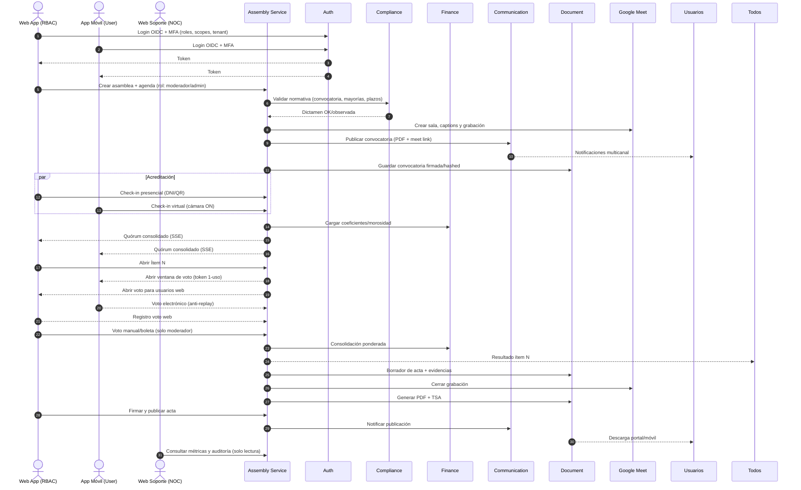

Flujos BA actualizados. Un solo **Web App (RBAC)** para todos los roles; **Web Soporte** solo NOC; **App Móvil** solo user.

# Orquestación SmartEdify (E2E)



# Assembly Service — detalle por fase

## Antes

**Entradas:** tipo, jurisdicción, agenda, plazos, padrón.
**Pasos:**

1. Crear asamblea → estado `Draft`.
2. Validar agenda/convocatoria con Compliance → `Validated`.
3. Crear sala Meet y configuración de grabación/captions.
4. Generar convocatoria PDF con instrucciones mixtas; sellar y guardar.
5. Publicar convocatoria por Communication → `Notified`.
   **Reglas:** solo ítems validados; plazos mínimos; hash y sello de tiempo obligatorios.
   **Salidas:** `agenda.validated`, `call.published`, `meet.created`.

## Durante

**Acreditación y quórum**

* Presencial: DNI/QR en Web App.
* Virtual: login + MFA + cámara ON en check-in (Móvil/Web).
* Asociar poderes y coeficientes (Finance).
* Tablero público de quórum por SSE para web y móvil.
  **Eventos:** `attendee.checked_in`, `quorum.updated`.

**Moderación y votación**

* Abrir ítem, step-up MFA si sensible.
* Emitir tokens 1-uso por votante/ítem (JTI).
* Anti-doble voto; recibo cifrado por voto.
* Votos manuales requieren boleta escaneada y motivo.
* Consolidar con Finance y publicar resultado en vivo.
  **Eventos:** `vote.opened`, `manual.vote.recorded`, `vote.closed`, `vote.results_published`.

**Incidencias**

* Pausa/reanudación con sellos; mociones y objeciones auditadas.
  **Eventos:** `session.paused|resumed`, `incident.logged`.

## Después

**Acta y archivo**

* Borrador automático con MPC + clips referenciados.
* Sección “Registros manuales” con hashes y anexos.
* Firma digital + TSA; publicación y notificación.
* Archivo WORM del expediente con hash raíz.
  **Eventos:** `minutes.signed`, `minutes.published`, `evidence.archived`.

---

# Flujos por interfaz

## Web App (RBAC)

* **Moderador/Admin:** crear/validar asamblea, acreditación presencial, abrir/cerrar ítems, registrar manuales, firmar/publicar acta, ver auditoría.
* **Propietario vía Web:** ver agenda, check-in virtual, votar, ver resultados, descargar acta.
* **Secretario:** redactar observaciones, co-firmar acta.
* **Soporte\_local:** monitoreo de sala, asistencia técnica, sin permisos de voto/manual.

## App Móvil (User)

* Login + MFA.
* Check-in con cámara, agenda/quórum en vivo.
* Voto 1-uso con recibo.
* Notificaciones y descarga de acta.

## Web Soporte (NOC)

* Métricas, trazas, auditoría, salud de servicios.
* Solo lectura. Sin operación de asambleas.

---

# Workflows por microservicio

## Auth Service

* **Login/Refresh/Step-up** para voto y firma.
* **Emisión de claims**: `tenant_id`, `roles`, `scopes`.
* **Auditoría** de sesiones y MFA.

## Compliance Service

* **Validación** de convocatoria/agenda/quórum y mayorías por jurisdicción.
* **Dictamen** con referencias legales y plazos.
* **Alertas** por cambios normativos.

## Finance Service

* **Coeficientes** y estado de morosidad.
* **Cálculo ponderado** por ítem y consolidación de resultados.
* **Snapshots** por asamblea.

## Communication Service

* **Convocatorias** con pruebas de envío y rebotes.
* **Recordatorios** y **publicación de acta** con acuses.

## Document Service

* **Convocatoria/Acta/Boletas**: almacenamiento, versiones, OCR.
* **Firma digital + TSA** y **WORM** del expediente.
* **Manifiesto** con hash raíz.

## Payments Service (opcional)

* Cobros asociados a asambleas si aplica; retorno a Finance.

## SupportBot Service

* Onboarding y FAQs guiadas; escalamiento a soporte.

## FacilitySecurity/Reservation/Maintenance/Payroll/Certification

* Soporte de recinto, reservas del salón, A/V, personal y cumplimiento del local cuando corresponda.

---

# Reglas y controles transversales

* **RBAC + ABAC** en APIs de Assembly: acción por rol y por ítem.
* **Cámara ON** en check-in virtual.
* **Anti-doble voto**: token JTI + índice único `(item_id, voter_id)` para `auto`.
* **Manual = boleta obligatoria**; sin anexo es inválido.
* **Quórum y resultados públicos** en tiempo real.
* **Trazabilidad**: sellos, hashes, TSA, manifiesto WORM.

# Entradas/Salidas por fase (mínimas)

* **Antes:** entrada agenda+padrón → salida convocatoria validada + meet\_link.
* **Durante:** entrada asistencias+votos → salida resultados consolidados + recibos.
* **Después:** entrada borrador+evidencias → salida acta firmada publicada + expediente WORM.
Aquí tienes los **contratos API**. Detallo completo **Assembly Service** en OpenAPI 3.1. Incluyo plantillas mínimas para los demás microservicios.

# Assembly Service — OpenAPI 3.1

```yaml
openapi: 3.1.0
info:
  title: Assembly Service API
  version: "1.0.0"
  description: >
    Gestión end-to-end de asambleas mixtas: convocatoria, acreditación, quórum,
    votación unificada, registros manuales con boleta, acta y archivo WORM.
servers:
  - url: https://api.smartedify.com/api/assembly/v1
security:
  - oauth2: [assembly:read, assembly:write]
tags:
  - name: Assemblies
  - name: Agenda
  - name: Meet
  - name: Call
  - name: Attendees
  - name: Voting
  - name: Manual
  - name: Minutes
  - name: Session
paths:
  /assemblies:
    post:
      tags: [Assemblies]
      summary: Crear asamblea
      security: [{oauth2: [assembly:write]}]
      requestBody:
        required: true
        content:
          application/json:
            schema: {$ref: '#/components/schemas/AssemblyCreate'}
      responses:
        "201": {description: Creada, content: {application/json: {schema: {$ref: '#/components/schemas/Assembly'}}}}
        "400": {$ref: '#/components/responses/BadRequest'}
        "401": {$ref: '#/components/responses/Unauthorized'}
    get:
      tags: [Assemblies]
      summary: Listar asambleas
      security: [{oauth2: [assembly:read]}]
      parameters:
        - in: query; name: status; schema: {type: string, enum: [Draft, Validated, Notified, CheckInOpen, InSession, MinutesDraft, Signed, Published, Archived]}
        - in: query; name: from; schema: {type: string, format: date-time}
        - in: query; name: to; schema: {type: string, format: date-time}
        - in: query; name: page; schema: {type: integer, minimum: 1, default: 1}
        - in: query; name: size; schema: {type: integer, minimum: 1, maximum: 200, default: 50}
      responses:
        "200": {description: OK, content: {application/json: {schema: {$ref: '#/components/schemas/PageAssemblies'}}}}
  /assemblies/{assemblyId}:
    get:
      tags: [Assemblies]
      summary: Obtener asamblea
      security: [{oauth2: [assembly:read]}]
      parameters: [{$ref: '#/components/parameters/assemblyId'}]
      responses:
        "200": {description: OK, content: {application/json: {schema: {$ref: '#/components/schemas/Assembly'}}}}
        "404": {$ref: '#/components/responses/NotFound'}
  /assemblies/{assemblyId}/agenda/validate:
    post:
      tags: [Agenda]
      summary: Validar agenda/convocatoria con Compliance
      security: [{oauth2: [assembly:write]}]
      parameters: [{$ref: '#/components/parameters/assemblyId'}]
      responses:
        "200": {description: Dictamen, content: {application/json: {schema: {$ref: '#/components/schemas/ComplianceReport'}}}}
        "409": {description: Observada, content: {application/json: {schema: {$ref: '#/components/schemas/ComplianceReport'}}}}
  /assemblies/{assemblyId}/call/publish:
    post:
      tags: [Call]
      summary: Publicar convocatoria multicanal
      security: [{oauth2: [assembly:write]}]
      parameters: [{$ref: '#/components/parameters/assemblyId'}]
      requestBody:
        content:
          application/json:
            schema:
              type: object
              properties:
                channels: {type: array, items: {type: string, enum: [email, sms, whatsapp, push]}}
                meetInstructions: {type: string}
              additionalProperties: false
      responses:
        "202": {description: Enviado}
  /assemblies/{assemblyId}/meet:
    post:
      tags: [Meet]
      summary: Crear sala Google Meet y configurar grabación/captions
      security: [{oauth2: [assembly:write]}]
      parameters: [{$ref: '#/components/parameters/assemblyId'}]
      responses:
        "201": {description: Creado, content: {application/json: {schema: {$ref: '#/components/schemas/MeetInfo'}}}}
  /assemblies/{assemblyId}/meet/start-recording:
    post:
      tags: [Meet]
      summary: Iniciar grabación
      security: [{oauth2: [assembly:write]}]
      parameters: [{$ref: '#/components/parameters/assemblyId'}]
      responses: {"200": {description: OK}}
  /assemblies/{assemblyId}/meet/stop-recording:
    post:
      tags: [Meet]
      summary: Detener grabación
      security: [{oauth2: [assembly:write]}]
      parameters: [{$ref: '#/components/parameters/assemblyId'}]
      responses: {"200": {description: OK}}
  /assemblies/{assemblyId}/session/open:
    post:
      tags: [Session]
      summary: Abrir sesión de acreditación
      security: [{oauth2: [assembly:write]}]
      parameters: [{$ref: '#/components/parameters/assemblyId'}]
      responses: {"200": {description: OK}}
  /assemblies/{assemblyId}/session/close:
    post:
      tags: [Session]
      summary: Cerrar sesión (fin de asamblea)
      security: [{oauth2: [assembly:write]}]
      parameters: [{$ref: '#/components/parameters/assemblyId'}]
      responses: {"200": {description: OK}}
  /assemblies/{assemblyId}/session/pause:
    post:
      tags: [Session]
      summary: Pausar sesión
      security: [{oauth2: [assembly:write]}]
      parameters: [{$ref: '#/components/parameters/assemblyId'}]
      responses: {"200": {description: OK}}
  /assemblies/{assemblyId}/session/resume:
    post:
      tags: [Session]
      summary: Reanudar sesión
      security: [{oauth2: [assembly:write]}]
      parameters: [{$ref: '#/components/parameters/assemblyId'}]
      responses: {"200": {description: OK}}
  /assemblies/{assemblyId}/attendees/checkin:
    post:
      tags: [Attendees]
      summary: Check-in presencial/virtual
      security: [{oauth2: [assembly:write]}]
      parameters: [{$ref: '#/components/parameters/assemblyId'}]
      requestBody:
        required: true
        content:
          application/json:
            schema: {$ref: '#/components/schemas/CheckInRequest'}
      responses:
        "201": {description: Registrado, content: {application/json: {schema: {$ref: '#/components/schemas/Attendee'}}}}
        "409": {description: Duplicado}
  /assemblies/{assemblyId}/proxies:
    post:
      tags: [Attendees]
      summary: Registrar poder de representación
      security: [{oauth2: [assembly:write]}]
      parameters: [{$ref: '#/components/parameters/assemblyId'}]
      requestBody:
        content:
          application/json:
            schema: {$ref: '#/components/schemas/ProxyCreate'}
      responses:
        "201": {description: Registrado, content: {application/json: {schema: {$ref: '#/components/schemas/Proxy'}}}}
  /assemblies/{assemblyId}/quorum/stream:
    get:
      tags: [Assemblies]
      summary: Stream de quórum en tiempo real (SSE)
      security: [{oauth2: [assembly:read]}]
      parameters: [{$ref: '#/components/parameters/assemblyId'}]
      responses:
        "200":
          description: text/event-stream
          content:
            text/event-stream:
              schema: {$ref: '#/components/schemas/QuorumEvent'}
  /items/{itemId}/vote/open:
    post:
      tags: [Voting]
      summary: Abrir ventana de voto para un ítem
      security: [{oauth2: [assembly:write]}]
      parameters: [{$ref: '#/components/parameters/itemId'}]
      requestBody:
        content:
          application/json:
            schema:
              type: object
              properties:
                mode: {type: string, enum: [nominal, secreto, coeficiente, bloques, delegados]}
                stepUpRequired: {type: boolean, default: false}
              required: [mode]
      responses: {"200": {description: OK}}
  /items/{itemId}/vote:
    post:
      tags: [Voting]
      summary: Emitir voto electrónico (token 1-uso)
      security: [{oauth2: [assembly:write, assembly:vote]}]
      parameters: [{$ref: '#/components/parameters/itemId'}]
      requestBody:
        required: true
        content:
          application/json:
            schema: {$ref: '#/components/schemas/VoteRequest'}
      responses:
        "201": {description: Voto registrado, content: {application/json: {schema: {$ref: '#/components/schemas/VoteReceipt'}}}}
        "409": {description: Doble voto o token usado}
  /items/{itemId}/vote/close:
    post:
      tags: [Voting]
      summary: Cerrar ventana de voto
      security: [{oauth2: [assembly:write]}]
      parameters: [{$ref: '#/components/parameters/itemId'}]
      responses: {"200": {description: OK}}
  /items/{itemId}/results:
    get:
      tags: [Voting]
      summary: Resultados consolidados del ítem
      security: [{oauth2: [assembly:read]}]
      parameters: [{$ref: '#/components/parameters/itemId'}]
      responses:
        "200": {description: OK, content: {application/json: {schema: {$ref: '#/components/schemas/VoteResult'}}}}
  /assemblies/{assemblyId}/attendees/manual:
    post:
      tags: [Manual]
      summary: Alta manual de asistencia (solo moderador/admin)
      security: [{oauth2: [assembly:manual:write]}]
      parameters: [{$ref: '#/components/parameters/assemblyId'}]
      requestBody:
        required: true
        content:
          application/json:
            schema: {$ref: '#/components/schemas/ManualAttendeeRequest'}
      responses:
        "201": {description: Registrado, content: {application/json: {schema: {$ref: '#/components/schemas/Attendee'}}}}
        "400": {$ref: '#/components/responses/BadRequest'}
  /items/{itemId}/votes/manual:
    post:
      tags: [Manual]
      summary: Registrar voto manual con boleta obligatoria
      security: [{oauth2: [assembly:manual:write]}]
      parameters: [{$ref: '#/components/parameters/itemId'}]
      requestBody:
        required: true
        content:
          application/json:
            schema: {$ref: '#/components/schemas/ManualVoteRequest'}
      responses:
        "201": {description: Registrado, content: {application/json: {schema: {$ref: '#/components/schemas/Vote'}}}}
        "400": {$ref: '#/components/responses/BadRequest'}
  /votes/{voteId}/override:
    post:
      tags: [Manual]
      summary: Override de voto existente con boleta y motivo
      security: [{oauth2: [assembly:manual:write]}]
      parameters: [{$ref: '#/components/parameters/voteId'}]
      requestBody:
        required: true
        content:
          application/json:
            schema: {$ref: '#/components/schemas/VoteOverrideRequest'}
      responses:
        "200": {description: OK}
  /assemblies/{assemblyId}/manual-records:
    get:
      tags: [Manual]
      summary: Auditoría de registros manuales
      security: [{oauth2: [assembly:read]}]
      parameters: [{$ref: '#/components/parameters/assemblyId'}]
      responses:
        "200": {description: OK, content: {application/json: {schema: {$ref: '#/components/schemas/ManualAudit'}}}}
  /assemblies/{assemblyId}/minutes/draft:
    post:
      tags: [Minutes]
      summary: Generar borrador de acta
      security: [{oauth2: [assembly:write]}]
      parameters: [{$ref: '#/components/parameters/assemblyId'}]
      responses: {"201": {description: Generado, content: {application/json: {schema: {$ref: '#/components/schemas/Minutes'}}}}}
  /assemblies/{assemblyId}/minutes/sign:
    post:
      tags: [Minutes]
      summary: Firmar acta (firma digital + TSA)
      security: [{oauth2: [assembly:minutes:publish]}]
      parameters: [{$ref: '#/components/parameters/assemblyId'}]
      responses: {"200": {description: Firmada}}
  /assemblies/{assemblyId}/minutes/publish:
    post:
      tags: [Minutes]
      summary: Publicar acta y notificar
      security: [{oauth2: [assembly:minutes:publish]}]
      parameters: [{$ref: '#/components/parameters/assemblyId'}]
      responses: {"200": {description: Publicada}}
  /assemblies/{assemblyId}/minutes:
    get:
      tags: [Minutes]
      summary: Obtener acta y metadatos
      security: [{oauth2: [assembly:read]}]
      parameters: [{$ref: '#/components/parameters/assemblyId'}]
      responses:
        "200": {description: OK, content: {application/json: {schema: {$ref: '#/components/schemas/Minutes'}}}}
components:
  securitySchemes:
    oauth2:
      type: oauth2
      flows:
        authorizationCode:
          authorizationUrl: https://auth.smartedify.com/oidc/authorize
          tokenUrl: https://auth.smartedify.com/oidc/token
          scopes:
            assembly:read: Lectura
            assembly:write: Operaciones
            assembly:vote: Emisión de voto
            assembly:manual:write: Registros manuales
            assembly:minutes:publish: Firma/publicación de acta
  parameters:
    assemblyId: {in: path, name: assemblyId, required: true, schema: {type: string}, description: ID de asamblea}
    itemId: {in: path, name: itemId, required: true, schema: {type: string}, description: ID de ítem de agenda}
    voteId: {in: path, name: voteId, required: true, schema: {type: string}, description: ID de voto}
  responses:
    BadRequest: {description: Petición inválida}
    Unauthorized: {description: No autorizado}
    NotFound: {description: No encontrado}
  schemas:
    AssemblyCreate:
      type: object
      required: [tipo, modalidad, fechaInicio, jurisdiccion, agenda]
      properties:
        tipo: {type: string, enum: [ordinaria, extraordinaria]}
        modalidad: {type: string, enum: [mixta, presencial, virtual]}
        fechaInicio: {type: string, format: date-time}
        direccionFisica: {type: string}
        jurisdiccion: {type: string}
        agenda:
          type: array
          items: {$ref: '#/components/schemas/AgendaItem'}
    Assembly:
      type: object
      properties:
        id: {type: string}
        tenantId: {type: string}
        estado: {type: string, enum: [Draft, Validated, Notified, CheckInOpen, InSession, MinutesDraft, Signed, Published, Archived]}
        tipo: {type: string}
        modalidad: {type: string}
        fechaInicio: {type: string, format: date-time}
        meet: {$ref: '#/components/schemas/MeetInfo'}
        hashConvocatoria: {type: string}
        createdAt: {type: string, format: date-time}
    PageAssemblies:
      type: object
      properties:
        items: {type: array, items: {$ref: '#/components/schemas/Assembly'}}
        page: {type: integer}
        size: {type: integer}
        total: {type: integer}
    AgendaItem:
      type: object
      required: [titulo, tipoDecision, mayoria, orden]
      properties:
        id: {type: string}
        titulo: {type: string}
        tipoDecision: {type: string, enum: [informativa, acuerdo]}
        mayoria: {type: string, enum: [simple, calificada]}
        normaRef: {type: string}
        orden: {type: integer}
    MeetInfo:
      type: object
      properties:
        meetLink: {type: string, format: uri}
        meetingId: {type: string}
        recordingEnabled: {type: boolean}
        captionsEnabled: {type: boolean}
    ComplianceReport:
      type: object
      properties:
        status: {type: string, enum: [approved, observed]}
        issues: {type: array, items: {type: string}}
        rulesetId: {type: string}
        timestamp: {type: string, format: date-time}
    CheckInRequest:
      type: object
      required: [personaId, canal]
      properties:
        personaId: {type: string}
        canal: {type: string, enum: [presencial, virtual]}
        selfieImageRef: {type: string, description: 'Ref en Document Service si aplica'}
        deviceId: {type: string}
    Attendee:
      type: object
      properties:
        id: {type: string}
        assemblyId: {type: string}
        personaId: {type: string}
        rol: {type: string, enum: [propietario, moderador, secretario, admin_condominio]}
        canal: {type: string}
        coeficiente: {type: number}
        source: {type: string, enum: [auto, manual]}
        createdAt: {type: string, format: date-time}
    ProxyCreate:
      type: object
      required: [otorganteId, apoderadoId]
      properties:
        otorganteId: {type: string}
        apoderadoId: {type: string}
        limite: {type: integer}
        vigenciaHasta: {type: string, format: date}
        evidenciaDocId: {type: string}
    Proxy:
      allOf:
        - $ref: '#/components/schemas/ProxyCreate'
        - type: object
          properties: {id: {type: string}}
    QuorumEvent:
      type: object
      properties:
        ts: {type: string, format: date-time}
        coefPresentes: {type: number}
        coefVirtuales: {type: number}
        coefPoderes: {type: number}
        total: {type: number}
    VoteRequest:
      type: object
      required: [voterId, tokenJti, value]
      properties:
        voterId: {type: string}
        tokenJti: {type: string, description: 'Token 1-uso'}
        value: {type: string, enum: [favor, contra, abstencion]}
    VoteReceipt:
      type: object
      properties:
        voteId: {type: string}
        receiptHash: {type: string}
        ts: {type: string, format: date-time}
    Vote:
      type: object
      properties:
        id: {type: string}
        itemId: {type: string}
        voterId: {type: string}
        mode: {type: string}
        value: {type: string}
        coefAplicado: {type: number}
        source: {type: string, enum: [auto, manual]}
        ballotDocId: {type: string}
        receiptHash: {type: string}
        ts: {type: string, format: date-time}
    ManualAttendeeRequest:
      type: object
      required: [personaId, motivo, ballotDocId]
      properties:
        personaId: {type: string}
        rol: {type: string}
        canal: {type: string, enum: [presencial, virtual]}
        motivo: {type: string}
        ballotDocId: {type: string}
    ManualVoteRequest:
      type: object
      required: [voterId, value, motivo, ballotDocId]
      properties:
        voterId: {type: string}
        value: {type: string, enum: [favor, contra, abstencion]}
        coefAplicado: {type: number}
        motivo: {type: string}
        ballotDocId: {type: string}
        overrideOf: {type: string, nullable: true}
    VoteOverrideRequest:
      type: object
      required: [motivo, ballotDocId]
      properties:
        motivo: {type: string}
        ballotDocId: {type: string}
    ManualAudit:
      type: object
      properties:
        attendees: {type: array, items: {$ref: '#/components/schemas/Attendee'}}
        votes: {type: array, items: {$ref: '#/components/schemas/Vote'}}
    Minutes:
      type: object
      properties:
        id: {type: string}
        assemblyId: {type: string}
        status: {type: string, enum: [Draft, Signed, Published]}
        urlPdf: {type: string, format: uri}
        tsaToken: {type: string}
        hash: {type: string}
```

# Plantillas mínimas OpenAPI para el resto

**Auth Service**

```yaml
openapi: 3.1.0
info: {title: Auth Service API, version: "1.0.0"}
servers: [{url: https://api.smartedify.com/api/auth/v1}]
paths:
  /oidc/authorize: {get: {summary: OIDC authorize, responses: {"302": {description: Redirect}}}}
  /oidc/token: {post: {summary: OIDC token, responses: {"200": {description: OK}}}}
  /oidc/introspect: {post: {summary: Introspect, responses: {"200": {description: OK}}}}
  /mfa/enroll: {post: {summary: Enrolar MFA, responses: {"200": {description: OK}}}}
  /mfa/verify: {post: {summary: Verificar MFA, responses: {"200": {description: OK}}}}
```

**Compliance Service**

```yaml
openapi: 3.1.0
info: {title: Compliance Service API, version: "1.0.0"}
servers: [{url: https://api.smartedify.com/api/compliance/v1}]
paths:
  /validate:
    post:
      summary: Validar convocatoria/agenda/quórum
      requestBody: {content: {application/json: {schema: {type: object}}}}
      responses: {"200": {description: OK}}
  /rules:
    get: {summary: Reglas por jurisdicción, responses: {"200": {description: OK}}}
```

**Finance Service**

```yaml
openapi: 3.1.0
info: {title: Finance Service API, version: "1.0.0"}
servers: [{url: https://api.smartedify.com/api/finance/v1}]
paths:
  /coefficients/{assemblyId}: {get: {summary: Snapshot coeficientes, responses: {"200": {description: OK}}}}
  /weighting/{itemId}: {post: {summary: Consolidar resultados ponderados, responses: {"200": {description: OK}}}}
```

**Document Service**

```yaml
openapi: 3.1.0
info: {title: Document Service API, version: "1.0.0"}
servers: [{url: https://api.smartedify.com/api/document/v1}]
paths:
  /files: {post: {summary: Subir archivo, responses: {"201": {description: Creado}}}}
  /search: {get: {summary: Buscar, responses: {"200": {description: OK}}}}
  /signatures: {post: {summary: Firmar documento TSA, responses: {"200": {description: OK}}}}
  /worm/archive: {post: {summary: Archivar expediente WORM, responses: {"201": {description: Creado}}}}
```

**Communication Service**

```yaml
openapi: 3.1.0
info: {title: Communication Service API, version: "1.0.0"}
servers: [{url: https://api.smartedify.com/api/comm/v1}]
paths:
  /messages: {post: {summary: Enviar mensaje, responses: {"202": {description: Aceptado}}}}
  /templates: {get: {summary: Listar plantillas, responses: {"200": {description: OK}}}}
  /campaigns: {post: {summary: Lanzar campaña, responses: {"202": {description: Aceptado}}}}
```

**Payments Service**

```yaml
openapi: 3.1.0
info: {title: Payments Service API, version: "1.0.0"}
servers: [{url: https://api.smartedify.com/api/payments/v1}]
paths:
  /intents: {post: {summary: Crear intent de pago, responses: {"201": {description: Creado}}}}
  /webhooks/{provider}: {post: {summary: Webhook PSP, responses: {"200": {description: OK}}}}
```

Si quieres, genero archivos separados `.yaml` listos para tu repositorio y agrego ejemplos de requests/responses por endpoint crítico.

