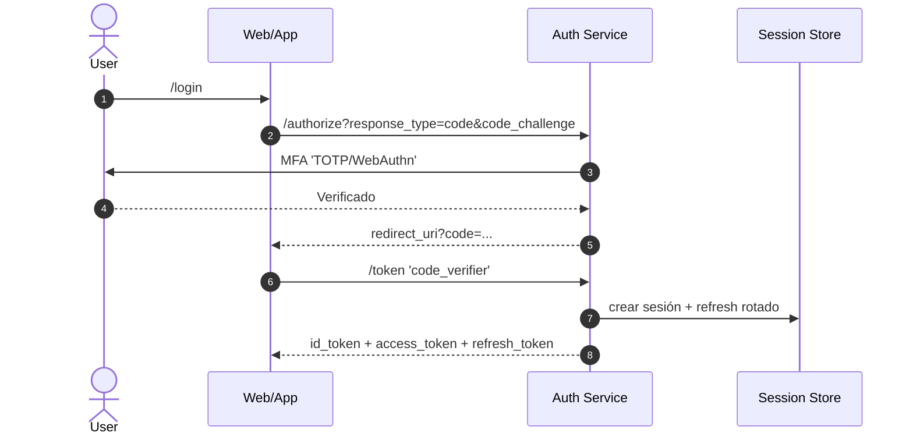
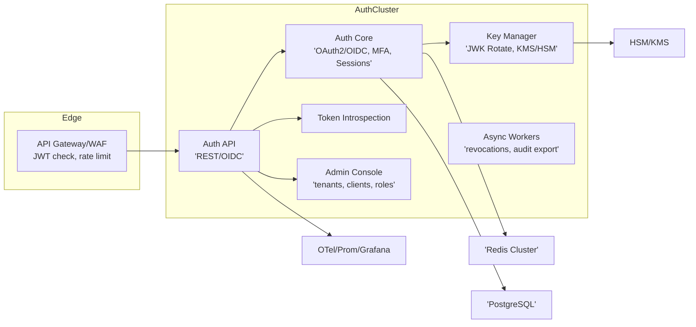

# Especificaciones de Diseño — Auth Service

## Alcance

Autenticación, MFA y emisión/validación de tokens para Web App, App Móvil y Web Soporte. Estándares OAuth2/OIDC. Validación en API Gateway y servicios. Propaga `tenant_id`, `roles`, `scopes`.

## Requisitos

* OIDC completo: `authorize`, `token`, `userinfo`, `jwks`, `introspection`, `revocation`, `discovery`.
* Flujos: Authorization Code + PKCE (móvil y web), Client Credentials (machine-to-machine).
* MFA: TOTP y WebAuthn. Step-up por acción sensible.
* Sesiones con rotación de refresh. Detección de reuse.
* Revocación por usuario, cliente o tenant.
* Auditoría de eventos de seguridad.
* Disponibilidad 99.9%, p95 < 150 ms en `token`/`introspect`.

## Políticas de tokens

* Access Token: JWT firmado (ES256 o RS256). TTL: 10 min. Áreas: `aud` por servicio; `scope` granular.
* Refresh Token: opaco, rotación obligatoria, TTL: 30 días rolling, reuse-detection → revoca cadena.
* ID Token: JWT OIDC con `nonce`, TTL: 10 min.
* JTI único, `iat`, `nbf`, `exp` estrictos. Clock skew: ±60s.
* Reclamos mínimos: `sub`, `tenant_id`, `roles`, `scp`, `amr` (MFA), `auth_time`, `jti`.

## MFA y Step-up

* Enrolamiento: TOTP (RFC6238), WebAuthn (resident/non-resident).
* Verificación MFA por defecto en login. Step-up condicionado por políticas (ej.: `assembly:minutes:publish`, `assembly:manual:write`).
* `amr` incluye `pwd`, `otp`, `webauthn`. `acr` opcional.

## Gestión de sesión

* Estado de sesión en Redis (stateless access, stateful refresh).
* Lista de revocación por `jti` y por “session family”.
* Reuse token detector: si refresh reutilizado → revoca familia y fuerza relogin.

## Seguridad

* Firmas con KMS/HSM. JWKS rotado cada 90 días. Key rollover con doble publicación.
* TLS 1.3, HSTS, SameSite=strict para cookies de first-party.
* Rate limit por IP/tenant/cliente. Bruteforce guard.
* Device-binding opcional para móvil (attestation + keypair local).

## Datos (modelo lógico)

* `users(id, tenant_id, email, phone, status, pwd_hash, pwd_salt, created_at)`
* `user_roles(user_id, tenant_id, role)` // `propietario`, `moderador`, `secretario`, `admin_condominio`, `soporte_local`, `noc`
* `clients(id, tenant_id, type, redirect_uris, pkce_required, scopes)`
* `consents(user_id, client_id, scope, granted_at)`
* `mfa_enrollments(user_id, type[TOTP|WebAuthn], secret_or_public_key, created_at, last_used_at)`
* `sessions(id, user_id, client_id, tenant_id, created_at, last_seen_at, revoked_at, reason)`
* `refresh_tokens(id, session_id, rt_hash, status[active|rotated|revoked], created_at, expires_at)`
* `revocation_list(jti, type[access|refresh], reason, created_at, expires_at)`
* `audit_security(id, actor, event, ip, ua, tenant_id, details_json, ts)`

Índices: `users(tenant_id,email)`, `refresh_tokens(session_id,status)`, `revocation_list(jti)`, `audit_security(tenant_id,ts)`.

## Flujos clave (BA/Dev)

### Login OIDC + MFA (Code+PKCE)



### Step-up MFA

* Trigger por `scope` sensible o cambio de contexto (`auth_time > N min`).
* Respuesta 401 con `www-authenticate: claims={"userinfo":{"acr":{"values":["urn:mfa:strong"]}}}`.

### Refresh Rotation

* Cliente invoca `/token` con `grant_type=refresh_token`.
* Emite nuevo par AT/RT. RT anterior → `rotated`. Reuse → revoca familia.

### Revocación

* Usuario: `/oauth/revoke` por sesión o todos los dispositivos.
* Admin tenant: revoca por `user_id` o por `client_id`.
* Efecto inmediato en introspection. AT sigue válido hasta exp salvo lista de jti.

## Observabilidad

* Métricas: `auth_login_total`, `mfa_challenge_total`, `token_issued_total`, `token_revoked_total`, `introspect_latency_ms`, `refresh_reuse_detected_total`.
* Tracing OTel con `tenant_id`, `client_id`, `session_id`.
* Logs firmados en `audit_security`.

---

# Arquitectura del Sistema — Auth Service

## Vista de contenedores



## Tecnologías

* Runtime: Go o Kotlin.
* Crypto: JOSE, FIDO2/WebAuthn, TOTP.
* Store: PostgreSQL, Redis.
* Keys: KMS/HSM.
* Deploy: Kubernetes, autoscaling.
* Cache: JWKS en gateway y servicios; TTL 15 min.

## Integraciones externas

* API Gateway: valida JWT, pasa `X-Tenant-ID`.
* Servicios SmartEdify: `introspection` opcional si política requiere.
* Web/App: OIDC/OAuth2.
* Notificaciones MFA opcionales vía Communication Service (fallback).

## Resiliencia

* Circuit breakers hacia DB/Redis/KMS.
* JWKS dual publish para rollover.
* Tolerancia a partición: acceso sigue stateless; refresh puede fallar con retry.

---

# Documentación de la API — Auth Service

## Endpoints OIDC/OAuth2

* `GET /.well-known/openid-configuration`
* `GET /oauth/authorize`
* `POST /oauth/token`
* `POST /oauth/introspect`
* `POST /oauth/revoke`
* `GET /oauth/jwks`
* `GET /oauth/userinfo`

## MFA

* `POST /mfa/enroll` (TOTP o WebAuthn)
* `POST /mfa/verify`
* `GET /mfa/methods`
* `DELETE /mfa/methods/{id}`

## Administración (tenant/cliente/roles)

* `POST /tenants` · `GET /tenants/{id}`
* `POST /clients` · `GET /clients/{id}` · `PATCH /clients/{id}`
* `POST /roles/assign` · `DELETE /roles/assign`
* `POST /sessions/{id}/revoke` · `POST /sessions/revoke-by-user`

## Introspección ligera para Gateway/Servicios

* `POST /oauth/introspect`

  * Body: `token`, `token_type_hint`.
  * Respuesta: `{ active, sub, tenant_id, scope, exp, iat, jti, amr }`.

## OpenAPI 3.1 (extracto clave)

```yaml
openapi: 3.1.0
info: {title: Auth Service, version: "1.0.0"}
servers: [{url: https://auth.smartedify.com}]
paths:
  /.well-known/openid-configuration:
    get: {summary: Discovery, responses: {"200": {description: OK}}}
  /oauth/authorize:
    get:
      summary: Authorization Code + PKCE
      parameters:
        - {in: query, name: response_type, schema: {type: string, enum: [code]}, required: true}
        - {in: query, name: client_id, schema: {type: string}, required: true}
        - {in: query, name: redirect_uri, schema: {type: string, format: uri}, required: true}
        - {in: query, name: scope, schema: {type: string}, required: true}
        - {in: query, name: code_challenge, schema: {type: string}}
        - {in: query, name: code_challenge_method, schema: {type: string, enum: [S256]}}
        - {in: query, name: state, schema: {type: string}}
        - {in: query, name: nonce, schema: {type: string}}
      responses: {"302": {description: Redirect with code}}
  /oauth/token:
    post:
      summary: Token & Refresh rotation
      requestBody:
        content:
          application/x-www-form-urlencoded:
            schema:
              type: object
              properties:
                grant_type: {type: string, enum: [authorization_code, refresh_token, client_credentials]}
                code: {type: string}
                code_verifier: {type: string}
                refresh_token: {type: string}
                client_id: {type: string}
                client_secret: {type: string}
      responses:
        "200":
          description: Tokens
          content:
            application/json:
              schema:
                type: object
                properties:
                  access_token: {type: string}
                  token_type: {type: string, example: Bearer}
                  expires_in: {type: integer}
                  refresh_token: {type: string}
                  id_token: {type: string}
  /oauth/introspect:
    post:
      summary: Introspect token
      requestBody:
        content:
          application/x-www-form-urlencoded:
            schema:
              type: object
              properties:
                token: {type: string}
                token_type_hint: {type: string, enum: [access_token, refresh_token, id_token]}
      responses:
        "200":
          description: Resultado
          content:
            application/json:
              schema:
                type: object
                properties:
                  active: {type: boolean}
                  sub: {type: string}
                  tenant_id: {type: string}
                  scope: {type: string}
                  exp: {type: integer}
                  iat: {type: integer}
                  jti: {type: string}
                  amr: {type: array, items: {type: string}}
  /oauth/revoke:
    post:
      summary: Revocar token
      requestBody:
        content:
          application/x-www-form-urlencoded:
            schema:
              type: object
              properties:
                token: {type: string}
                token_type_hint: {type: string}
      responses: {"200": {description: OK}}
  /oauth/jwks:
    get: {summary: JWKS, responses: {"200": {description: OK}}}
  /oauth/userinfo:
    get:
      summary: UserInfo
      security: [{bearerAuth: []}]
      responses: {"200": {description: OK}}
  /mfa/enroll:
    post:
      summary: Enrolar MFA
      requestBody:
        content:
          application/json:
            schema:
              type: object
              properties:
                type: {type: string, enum: [totp, webauthn]}
      responses: {"200": {description: Enrolado}}
  /mfa/verify:
    post:
      summary: Verificar MFA / Step-up
      requestBody:
        content:
          application/json:
            schema:
              type: object
              properties:
                type: {type: string, enum: [totp, webauthn]}
                code: {type: string}
      responses: {"200": {description: OK}}
components:
  securitySchemes:
    bearerAuth:
      type: http
      scheme: bearer
      bearerFormat: JWT
```

## Scopes y ejemplos

* Scopes base: `openid profile email tenant.read roles.read`.
* Scopes de aplicación: `assembly:read`, `assembly:write`, `assembly:vote`, `assembly:manual:write`, `assembly:minutes:publish`.
* Ejemplo `amr`: `["pwd","otp"]` o `["pwd","webauthn"]`.

## Reglas de claims

* `roles`: lista controlada por tenant.
* `scp`: espacios separados `"assembly:read assembly:vote"`.
* `tenant_id`: obligatorio.
* `auth_time`: epoch del último MFA.

## Errores estándar

* `invalid_request`, `invalid_client`, `invalid_grant`, `invalid_scope`, `interaction_required`, `mfa_required`, `reuse_detected`.

---

¿Necesitas este documento exportado a archivos separados (`/docs/design/auth/…`) y plantillas de configuración para el Gateway (políticas de scopes por ruta)?
