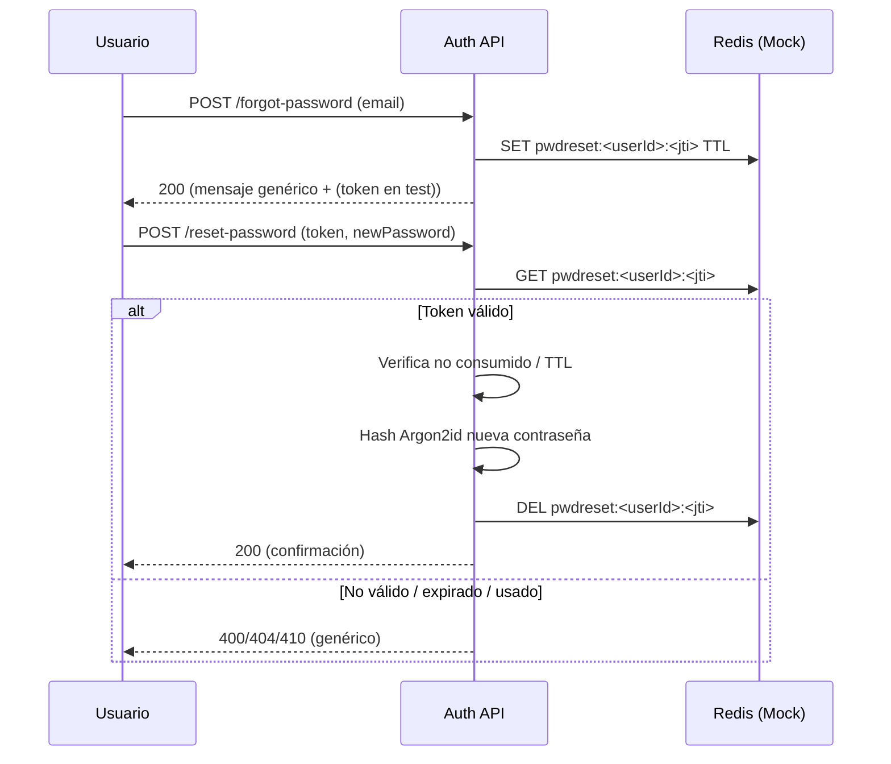

# Flujo de Password Reset (Auth Service)

Este documento describe el diseño actual del flujo de recuperación y restablecimiento de contraseña, su instrumentación de métricas y consideraciones de seguridad.

## Objetivos
- Permitir a un usuario restablecer su contraseña sin exponer si un email existe.
- Asegurar tokens de un solo uso con expiración y namespacing que eviten colisiones.
- Instrumentar métricas para detectar abuso y monitorear efectividad.

## Componentes
| Componente | Rol |
|------------|-----|
| Handler `/forgot-password` | Genera token y responde idempotentemente (respuesta uniforme). |
| Handler `/reset-password` | Valida token, re-hashea contraseña y consume el token. |
| Almacenamiento tokens | Mock Redis (in-memory) con clave namespaced. |
| Hashing | Argon2id con parámetros reducidos en test. |
| Métricas | Contadores de solicitudes y completados. |

## Flujo


## Namespacing de Claves
Formato: `pwdreset:<userId>:<jti>`
- `userId`: identificador interno del usuario.
- `jti`: UUID v4 del token.
- Evita colisiones con otros espacios (refresh tokens, rate limit, etc.).

## Métricas
| Métrica | Tipo | Descripción |
|---------|------|-------------|
| `auth_password_reset_requested_total` | Counter | Incrementa al solicitar reset (email válido o no). |
| `auth_password_reset_completed_total` | Counter | Incrementa al completar un reset válido. |

### Ejemplo de Scrape
```text
# HELP auth_password_reset_requested_total Password reset requests
# TYPE auth_password_reset_requested_total counter
auth_password_reset_requested_total 3
# HELP auth_password_reset_completed_total Password reset completed
# TYPE auth_password_reset_completed_total counter
auth_password_reset_completed_total 1
```

## Consideraciones de Seguridad
| Riego | Mitigación |
|-------|------------|
| Enumeración de emails | Respuesta homogénea en `/forgot-password`. |
| Reuso de token | Borrado inmediato (`DEL`) tras éxito en `/reset-password`. |
| Ataques de fuerza bruta sobre tokens | TTL corto + formato UUID (aleatorio suficiente). |
| Exposición de token en test | Solo en entorno test para facilitar aserciones. |
| Robo de token en tránsito | (Futuro) exigir HTTPS y policy de no-logging. |

## Errores
| Código | Caso |
|--------|------|
| 400 | Token malformado / password inválida. |
| 404 | Token no encontrado. |
| 410 | Token expirado (si se materializa diferenciación). |

## Roadmap
1. Registrar timestamp y origen IP de solicitud para auditoría.
2. Agregar métrica de intentos fallidos de reset.
3. Persistir eventos `password.reset.requested` / `password.reset.completed` en outbox.
4. Integrar protección de antifraude (ratelimit específico + fingerprint opcional).
5. Añadir invalidación global de sesiones activas tras reset.

## Pruebas
- Caso feliz end-to-end (solicitud → reset).
- Token inválido (formato incorrecto / inexistente).
- Reutilización (mismo token dos veces → segundo intento falla).
- Email inexistente en `/forgot-password` (métrica requested incrementa igualmente).

## Enlaces Relacionados
- README Auth Service (sección “Flujo de Password Reset”).
- Estrategia de Testing (`docs/testing/auth-service-strategy.md`).
