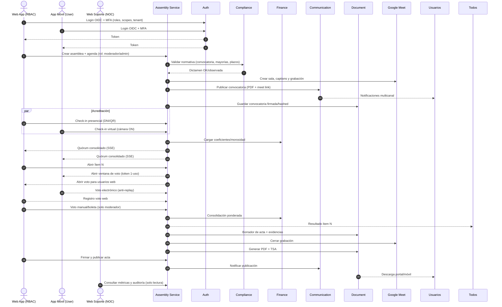

## Estado (2025-09-17)
- En espera de contratos cross-service definitivos (Auth/Tenant/User).
- No iniciar endpoints hasta cerrar contrato de `tenant-context` y `user.registered`.

## Próximos pasos
1. Definir casos de uso iniciales y dependencias (read models).
2. Esbozar esquema de eventos a consumir (versión 0) y validación.
3. Preparar test harness con mocks de productores (Auth/User/Tenant).
# Plan — assembly-service

## Visión y objetivos

### Visión del producto
El **Assembly Service** permite ejecutar asambleas mixtas (presenciales y virtuales) de forma legal, auditable y transparente, orquestando convocatorias, acreditación, quórum, votación unificada, actas y archivo inmutable dentro del ecosistema SmartEdify.

### Objetivos principales
- Garantizar igualdad de derechos entre participantes presenciales y virtuales.
- Automatizar la generación de actas firmadas digitalmente con trazabilidad.
- Integrar Auth, Tenant, Compliance, Finance, Document, Communication y Payments para ofrecer una experiencia end-to-end.

### Público objetivo
- Propietarios: participan vía Web App o App Móvil para acreditarse, votar y acceder a actas.
- Moderadores/Administradores: gestionan convocatoria, agenda, acreditación, votos manuales y publicación de actas.
- Secretarios: co-firman actas y registran observaciones.
- Soporte local y NOC: monitorean métricas y auditoría sin intervenir en los votos.

### Alcance funcional
- Creación, validación y publicación de convocatorias multicanal.
- Acreditación presencial (DNI/QR) y virtual (login + MFA + cámara ON) con quórum consolidado en tiempo real.
- Gestión de poderes de representación y asociación de coeficientes provenientes de Tenant/Finance.
- Apertura/cierre de ítems de agenda, votación electrónica con token de un solo uso y registro de votos manuales.
- Consolidación ponderada de resultados, generación de acta con firma digital + TSA y archivo WORM.
- Notificaciones multicanal de convocatoria, resultados y publicación del acta.
- Integración con Google Meet para sala, grabación y captions.

### Restricciones y requisitos legales
- Google Meet es la única plataforma de videoconferencia soportada en el MVP.
- Firma digital alineada con estándares SUNAT/RENIEC y almacenamiento WORM obligatorio.
- Tokens de voto con TTL inferior a 5 minutos y step-up MFA para acciones sensibles.
- Convocatorias deben indicar modalidad mixta y quórum debe consolidarse con datos provistos por Tenant y Finance.

### Requisitos no funcionales
- Rendimiento: hasta 10k votos por minuto; latencia de voto p95 < 200 ms.
- Disponibilidad 99.9 % durante ventanas de asamblea.
- Escalado horizontal en Kubernetes con observabilidad completa (métricas, logs y traces OTel).
- Seguridad: MFA obligatorio, TLS 1.3, cifrado en reposo, RBAC/ABAC, auditoría exhaustiva.
- Usabilidad: UI accesible (WCAG 2.1 AA) con subtítulos en tiempo real.

### Métricas de éxito
- Acta firmada y publicada ≤ 24 h después de la sesión.
- > 98 % de entregabilidad en convocatorias y notificaciones.
- 0 incidencias de doble voto reportadas.
- Auditoría legal completa disponible ante impugnaciones.

### Integraciones clave
- **Auth Service** para OIDC, MFA y validación de tokens.
- **Tenant Service** para membresías, roles de gobernanza y coeficientes.
- **Finance Service** para morosidad y ponderaciones.
- **Document Service** para almacenamiento, firma TSA y archivo WORM.
- **Communication Service** para notificaciones multicanal.
- **Payments Service** para pagos asociados cuando aplique.
- **Google Meet API** para sala, grabación y captions.

### Riesgos y mitigaciones
- Fallos de conectividad en sala → redundancia de red y grabación de respaldo.
- Impugnaciones por identificación débil → MFA obligatorio, cámara ON y trazabilidad completa.
- Ataques de doble voto → tokens JTI de un solo uso y locks por votante/ítem.
- Pérdida de evidencias → archivo WORM con hash raíz y sellado de tiempo.
- Fallos de la API de Meet → protocolos de contingencia y registro de incidentes.

## Roadmap incremental

### Fase 0 — Preparación
- Revisión legal final, acuerdos de contrato OpenAPI y preparación de infraestructura (repositorios, CI/CD, observabilidad).

### Fase 1 — Núcleo de asamblea
- CRUD con estados Draft → Validated → Notified, validación de agenda con Compliance, sala Meet y convocatoria PDF.

### Fase 2 — Acreditación y quórum
- Check-in presencial/virtual, poderes y coeficientes, tablero SSE y logs por canal de acreditación.

### Fase 3 — Votación unificada
- Apertura/cierre de ítems, tokens JTI, registro electrónico/manual y consolidación ponderada con Finance.

### Fase 4 — Acta, firma y archivo
- Borrador MPC, firma digital + TSA, notificación y archivo WORM.

### Fase 5 — Auditoría, observabilidad y soporte
- APIs de auditoría, tablero NOC y alertas proactivas (quórum, latencia, fallos externos).

### Fase 6 — Optimización y extensiones
- Subtítulos automáticos en actas, OCR de boletas, modos de votación avanzados y pruebas de carga para validar escalado.

| Fase                   | Objetivo clave                              | Entregable destacado                    |
| ---------------------- | ------------------------------------------- | --------------------------------------- |
| 0. Preparación         | Bases técnicas y legales                    | Infraestructura lista                   |
| 1. Núcleo Asamblea     | Convocatoria legal y trazable               | Publicación `assemblies/*` y `meet/*`   |
| 2. Acreditación/Quórum | Identificación fehaciente y tablero en vivo | APIs `attendees/checkin`, `proxies`     |
| 3. Votación Unificada  | Resultado auditado en tiempo real           | APIs `vote/*`, consolidación ponderada  |
| 4. Acta/Firma/Archivo  | Acta legal firmada y archivada              | APIs `minutes/*`, notificación y WORM   |
| 5. Auditoría/Soporte   | Observabilidad para NOC                     | Métricas y manifiesto de evidencias     |
| 6. Extensiones         | Experiencia ampliada                        | Subtítulos, OCR y validación de escala  |

### Dependencias críticas
- Auth y Tenant con MFA/contexto listos antes de Fase 2.
- Finance con coeficientes y morosidad antes de quórum ponderado.
- Document con firma TSA/WORM antes de publicar actas.
- Communication operativo desde Fase 1.
- Integración con Meet validada desde la fase inicial.

## Flujos y experiencia

### Orquestación end-to-end

### Detalle operativo por fase
**Antes:** crear asamblea, validar agenda, crear sala Meet, generar y publicar convocatoria con hash y sellado de tiempo.

**Durante — acreditación y quórum:** check-in presencial y virtual, asociación de poderes y coeficientes y tablero SSE con eventos `attendee.checked_in` y `quorum.updated`.

**Durante — moderación y votación:** apertura de ítems con step-up MFA opcional, emisión de tokens de un solo uso, registro de votos electrónicos y manuales y publicación de resultados (`vote.opened`, `manual.vote.recorded`, `vote.results_published`).

**Durante — incidencias:** pausa/reanudación auditada (`session.paused|resumed`) y registro de mociones/objeciones.

**Después:** borrador de acta con anexos, firma digital, publicación y archivo WORM (`minutes.signed`, `minutes.published`, `evidence.archived`).

### Flujos por interfaz
- **Web App (RBAC):** moderadores y administradores gestionan convocatoria, acreditación presencial, apertura/cierre de ítems, registro manual de votos, firma y publicación de acta. Propietarios web participan y descargan actas. Secretarios co-firman y agregan observaciones. Soporte local monitorea sala sin permisos de voto.
- **App móvil (User):** login + MFA, check-in virtual con cámara, agenda/quórum en vivo, voto de un solo uso con recibo y acceso a resultados.
- **Web Soporte (NOC):** consumo de métricas, auditoría y salud del servicio en modo sólo lectura.

## API y contratos
- El contrato OpenAPI 3.1 oficial vive en `api/openapi/assembly.yaml`. Mantenerlo como fuente única y sincronizar la documentación funcional con ese archivo.
- Endpoints clave abarcan `assemblies/*`, `attendees/*`, `items/*/vote`, `minutes/*` y `session/*`, exponiendo SSE para quórum y resultados.

## Fast-track MVP

### Objetivo
Gestionar convocatorias, acreditación, votación y actas mínimas con el menor tiempo de implementación posible.

### Alcance inicial
- Convocatoria básica con título, fecha y tenant.
- Registro de asistentes con acreditación mínima.
- Votación binaria en un único ítem.
- Generación de acta como documento PDF provisional.

### Endpoints evolutivos
- `POST /assemblies` → crear convocatoria.
- `POST /assemblies/{id}/attendees` → registrar asistente.
- `POST /assemblies/{id}/votes` → emitir voto.
- `GET /assemblies/{id}/minutes` → obtener acta.

### Eventos de dominio
- `assembly.created`
- `assembly.attendee.registered`
- `assembly.vote.cast`
- `assembly.minutes.generated`

### Dependencias mínimas
- Auth (OIDC básico).
- Tenant.
- Document Service (para acta).
- Communication (convocatoria enviada).
- Compliance-lite.

### Backlog rápido
- [ ] Scaffold servicio con `/health`.
- [ ] Modelo Assembly con estado inicial.
- [ ] Endpoint create convocatoria.
- [ ] Registro de asistentes.
- [ ] Voto binario.
- [ ] Generar acta stub.
- [ ] Publicar eventos básicos.
